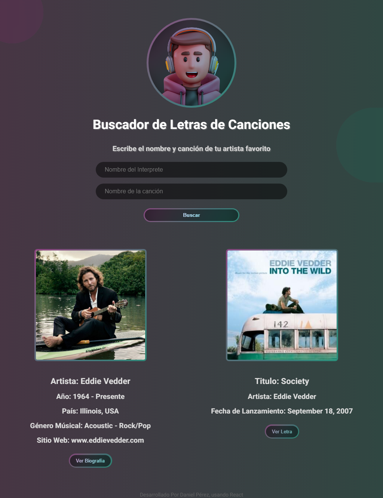

# Buscador de Canciones y Artistas
### Proyecto Práctico desarrollado en ReactJs

###### Este Proyecto consiste en hacer una búsqueda de algún Artista y canción para  mostrarlo en pantalla. Al hacer un llamado a una API gratuita, esta trae datos que la persona puede conocer acerca del artista y canción que se busque.

### Ver Proyecto:

[URL: buscador de canciones](https://buscador-de-musica.netlify.app/)

###### Las apis usadas son:

* _theaudiodb_ 

- Para Traer datos del Artista como:

+ Imagen del artista buscado
+ Nombre
+ Año de nacimiento
+ País
+ Genero musical
+ Sitio Web del artista
+ Biografía, esta se muestra en una ventana Modal

* _genius_

- Para traer datos de la canción como:
 
+ Título de Canción
+ Foto del visualizer de la canción
+ Fecha de Lanzamiento
+ Sitio Web donde pueden ver la letra de la canción

###### El objetivo de esta aplicación práctica es para hacer uso de _fetch_

###### También se creo un archivo llamado helpHTTP, el objetivo de este archivo es conocer la lógica de fetch y poder reusarlo con diferentes apis.
